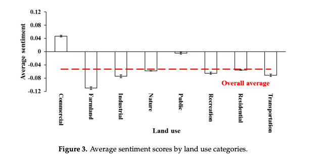
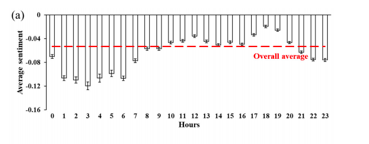

## 11/18/19: Twitter Data Case Use assignment 

  This week, we have been learning how to utilize Twitter API data for use in spatial analyses. In class and labs, we explored Twitter data as it related with natural disaster (i.e. forest fires) and the weather (relating to a recent snow storm). I think Twitter and other social media platforms allow us an abundance of "people data" and can help fill in the blanks of qualitative, relative, and/or experiential information on the lived experience of "place". 
    
  For this Monday's assignment, I chose to analyze [this study](https://pdfs.semanticscholar.org/3c21/a45ad99e175d68ddf1155cd96d7df8dadd7c.pdf), called "Using Twitter to Better Understand the Spatiotemporal Patterns of Public Sentiment: A Case Study in Massachusetts, USA" by Cao et. al. What interested me most about this case is their analysis of a Tweet's text for their study of happiness (positive sentiments vs. negative sentiments) in varying spaces/land uses, and at different times. For me, a study which utilizes the body of text in a tweet to better understand public sentiments seems to be the most valuable extrapolation of social media data. 
      
  This inductive study collected Twitter data throughout Massachusetts, most coming from Boston, from November 2012 to June 2013. From that large date range, they narrowed down their data to use only geocoded tweets located within a 1 mile radius of schools; to them this encompasses all relavant urban/suburban areas in which they were interested in evaluating the quality of life and happiness. They also included only tweets originally composed in English. From their pool of data, they mapped the tweets onto MA and noted various land use patterns, which was another component of this study: where do people tweet positive things and where don't they? 
  
  This graph shows indexed "sentiment scores" as they correspond with different land uses in MA. It seems to show that spaces marked as "commercial" and "public" tend to feature more positive/happy tweets, while spaces such as farmland and transportation show quite negative public sentiment. 
  
  
  
  It is also worth pointing out how they created their index of sentiment, as it can seem quite difficult to create a relative score of emotion using only data. The authors utilized the IBM Watsom Alchemy API, which is capable of cloud-based language processing. Its linguistic analysis is able to analyse a tweet's composition and search for certain words linked to either positive or negative emotions. From there, it gave a "sentiment score" from -1 (extremely negative) to 1 (extremely positive), with 0 marking a neutral sentiment. They also created a "Net Sentiment Rate" from the cumulative score of all their tweets, which was -0.065. Because of the API engine they used, I am unsure how reproducible their method of analysis would be. 
  
  Another variable analyzed was time, as shown in the following graph: 
  
  
  
  Together with the sentiment score spatially analyzed in relation to land use and time of day, we can start to see patterns of human sentiment and emotion regarding their built and lived experience in cities. This to me seems an extremely valuable use of social media data, as I mentioned previously. Many of the correlations shown in this data make a lot of sense, and could be used to help better understand public opinion and improving urban infrastructure. 
  
  
  
  [home page](index.md)
