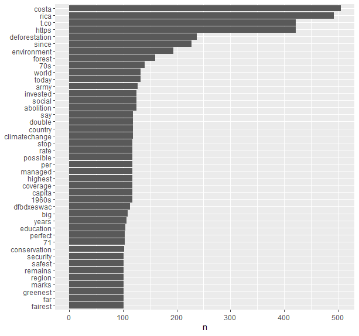
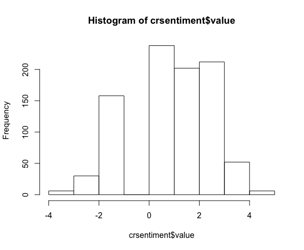

## Final Project: Analyzing Sentiment in Twitter Data about Costa Rica's Natural Resources

Our final project for Open Source GIS was to take our learning one step further by using that knowledge to incorporate a new skill. I really enjoyed working with R and Twitter data, and so I chose to craft a project utilizing those platforms to do something new. I used R to download Twitter data mentioning Costa Rica and some word related to nature, and then analyzed sentiment of the raw tweet text. Going into this project, I expected most tweets mentioning Costa Rica's natural resources to be positive, and thus very likely refering to ecotourism and travel. I think analysis like these help us to understand the "normalized" conceptualization of place by those outside the country. I was hoping to see, then, how Costa Rica is predominately seen as a tourist destination before anything else. 

### Data and code 

[R script](cr_twitterscript.R)

Data tables from Twitter and R (not included to protect privacy of Twitter users)

RStudio 

Twitter 

### Methods 

1. Following along with the R code, we see that the first step after initializing necessary libraries is to connect to Twitter's API and search for relevant tweets. In order to create my first data table, crtweets, I simply searched for every tweet containing the words "costa" AND "rica". After getting these baseline tweets, I then modified my search to include the nature component:

  crnature <- search_tweets("costa and rica and (nature OR beach OR environment OR forest OR park)", n=15000, retryonratelimit=FALSE, include_rts=TRUE, token=twitter_token). 
  
2. Next came unpacking the raw text located in the tweets. When receiving a data set from a Twitter search, the body of the tweets are put into one column, "text", in which the entirety of the tweet is placed. In order to conduct a sentiment analysis, this column has to be deconstructed so that every word is its own column. It is also important to remove "stop words" like and/or/is/etc that contain no value for a sentiment analysis. I accomplished this using the TidyText r package and the "unnest token" function. 

    naturetoken <-
  unnest_tokens(crnature,word,text,token="words",format = c("text"),to_lower=TRUE, drop=TRUE,collapse=NULL)%>%
  anti_join(get_stopwords(),by = "word")
  
3. After every relevant word is displayed in its own row, a sentiment analysis is possible. There are three possible lexicons which can analyze sentiment within the TidyText package. For my purposes, I chose the AFinn lexicon, which gives words a score from -5 (negative) to 5 (positive), as I thought it would be the best for displaying sentiment in a graph. After getting the Afinn sentiment data set, I conducted an inner join to naturetoken to create my final data table, crsentiment. 

    afinn_sentiment <-get_sentiments(lexicon =c("afinn"))

    crsentiment <- naturetoken %>%
     inner_join(afinn_sentiment, by ="word")
     
4. Now every word is associated with a value in the data set, and we can begin to analyze the sentiment of the common words in a data set about Costa Rica and nature. 

* Full disclosure: I really struggled with creating the graph I was imagining, which would display the most common words (words appearing more than 10 times in the data table) as x and their sentiment score as y. The problem I could not solve was how to create a secondary column which displayed the counts of that word throughout the data table. I was able to show counts, but not combine them into their own column. As such, I was unable to realize my ideal final graph. 

### Results

Despite that setback, their is still a possibility of analysis. First, I graphed the most common words found in crsentiment by their frequency (n).

I found this to be very interesting: some of the top relevant words (excluding things like "costa", "rica", "t.co" etc...) are negative words: "deforestation", "army", "abolition", "climatechange". In fact, none of the top words are things like "beautiful", "vacation", "paradise" or similar positive words I was expecting to find. 

After discovering this, I decided to graph the distribution of sentiment values in the data set, and found a relatively even distribution, with slightly more positive/neutral words. This makes sense as many of the top words are unlikely to be present in the AFinn lexicon: words like "since", "70s", "world", etc. 

### Discussion 

Although I was unable to prove my hypothesis that most tweets would refer to Costa Rica as a positive nature reserve, thus showing its perception as a tourist destination, I still think my results are very interesting. Instead of most common tweets being positive, they were actually negative: words like "deforestation" and "conservation" lead me to believe that in fact most Twitter users are talking about the country in regards to its conservation efforts and recovery from deforestation. This comes as a pleasant surprise and hints at cultural shift among younger generations especially to emphasize ecological impacts of climate change and human actions like deforestation in place of a picturesque tropical paradise. 

[home](index.md)
  
