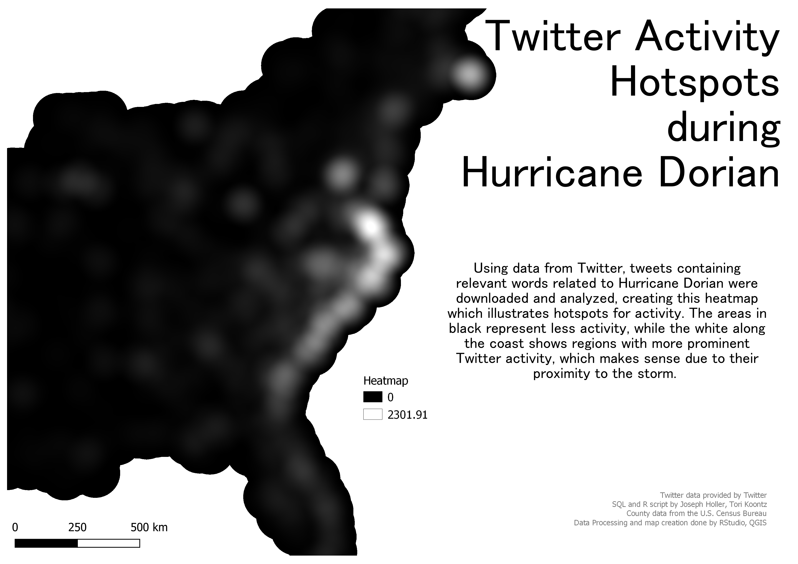
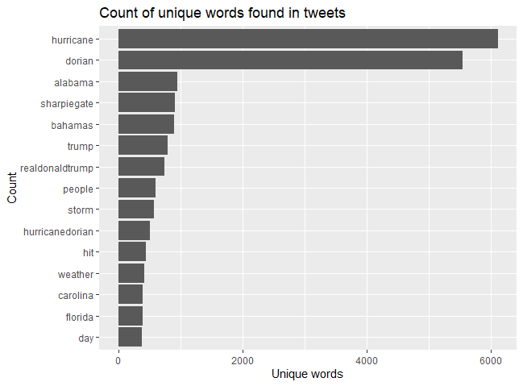
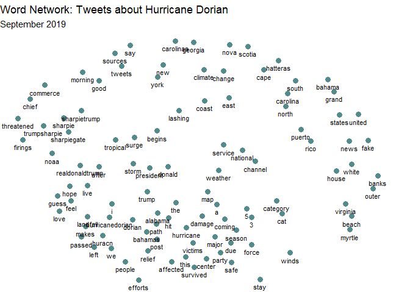

## Georeferencing Twitter Data to Analyze Tweet Patterns During Hurrican Dorian 

For our final lab in GEOG323, welearned how to access Twitter data through their API platform. Utilizing social media data can be extremely useful for understanding public opinion on relevant events, but such a powerful data source should be used carefully and responsibly. For example, any shareable result of Twitter data should be aggregated so that individual personal information is not public and identifiable (it's actually in the Twitter API's user agreement!). During this lab, we learned how to collect Twitter data regarding Hurricane Dorian, how to georeference those tweets, aggregate them, and present our findings using a Kernel Density heatmap. 

### Methods 

Data sources: 
1. Twitter data, accessed using [this R script](dorianTwitterScript.R), provided by Prof. Joseph Holler. You will need to sign up for your own Developer Account with Twitter before you can search the API.
2. [Another R script](twitterForLab.R) which pulled specific geographic information from tweets as well as other analysis
3. U.S. Census data, pulled in using the R scripts. You also need a Census API for this. 

Platforms: 
1. QGIS 3.8.1 
2. PostGIS
3. Twitter
4. RStudio 
5. Geo Da

Our first step was to get the Twitter data we were interested in analyzing. This can be seen in the R scripts, and you can edit the code to first include your API information, and then also what you are interested in searching. Remember to change variables such as number of tweets, including retweets or only tweets with geographic information, etc. Using R scripts, we search Twitter data and created two tables, "Dorian" for tweets regarding the hurricane, and "November", which served as our baseline of Twitter activity, used later when we calculate a tweet rate for aggregated analysis. 

The R scripts also contain code to locate the geographic information, textual analysis to find key words, and then spatial analysis. There's also a section which pulls from the U.S. Census API to retrieve county information we needed. Reference the scripts for more details. 

After creating data tables with all relevant information ("dorian", "november", "counties"), next came uploading that data into our PostGIS databases, also included in the R script. 

Using QGIS's DB Manager, we used this [SQL](noteslab10.sql) to prepare data for spatial analysis. First, we reprojected the data into an accurate Coordinate reference system (SRS code: 102004). Next, we added a geometry column to store point geometry of the data. We narrowed down counties to only included areas of interest, which for us was the East Coast of the U.S. We then added a column for a count of each kind of tweet ("dorian" and "november") by county. 

Finally, we normalized the data in order to protect privacy, and displayed tweets by a calculated "tweet rate" per 10,000 people. We also calculated the NDTI, which normalizes data and provides variability in activity on a scale of -1 (low activity) to 1 (high activity). This was calculated by using this formula: 

(doriantweets - novembertweets * 1.0) / (doriantweets + novembertweets)

Now that we had a normalized activity rate that was geographically indexed, we could begin analysis. This was performed through the desktop application of Geo Da, and we were able to calculate a spatial weight matrix and the G* statistic (both as functions within GeoDa), which produced [this map](tweetgeoda.png) of significant areas of tweet activity. The significance map aligned with our expected results and showed high levels of significance along the southeastern coast, in states such as Florida, Alabama, and the Carolinas. 

Finally, we ran the Heatmap/Kernel Density tool in QGIS to create a map of Twitter activity hotspots during the storm. This was our final result: 

## Results 

Before creating the final map, we also took advantage of some graphing capabilities within RStudio, which helped us analyze the Twitter data collected before moving into greater spatial analysis operations. Here are counts of the most common words found in the tweets we pulled: 

As the graph shows, the two most common words were overwhelmingly "hurricane" and "dorian", followed by other relevant words like "alabama", "bahamas", "storm", and "hurricanedorian", which was most likely a hashtag. However, this graph also helps us understand that, when collecting Twitter data, there can be quite a few outliers that use similar words but are discussing a different topic (or at least different perspective) than the study area. Here we see that this data includes numerous examples referencing "sharpiegate", or President Trump's erroneous map detailed the storm trajectory. Related, but not quite the same. This is one of the major challenges when analyzing raw text pulled from social media, especially on an aggregated level where it is difficult to parse through which is which. It is important to understand that the multifaceted nature of raw text and word use will always be a spot for uncertainty and error in results. 

We also used RStudio to create a network of word associations, which helps us parse through this issue of "Hurricane vs. Sharpiegate" by understanding the relationship between common words. 

This network analysis helped me feel a bit more confident in using this data to analyze hotspots of activity related to the storm (knowing there were also tweets about the Trump incident). In the more clustered section are all words relevant to our study and seem directly related to the actual storm: "hurricane", "damage", "survived", "efforts" etc. Further out from this central cluster are words relating to Trump or the Sharpie incident, and even further out are words mentioning geographic locations; geography words are more likely to be used together than they are to be used with any other word, which makes a lot of sense when considering names like "Puerto Rico" and "United States". 

And finally, our heatmap correlates to what we saw in Geo Da and also what we were expecting to see: regardless of storm/sharpie references, the activity hotspots for this event were all located along the storm's path on the southeastern U.S. coastline. Plus, after seeing the word count and network graphs from R, we can be more confident in the fact that the data driving these results are more centered on the actual storm than the sharpie incident. 

Back to [home](index.md)
