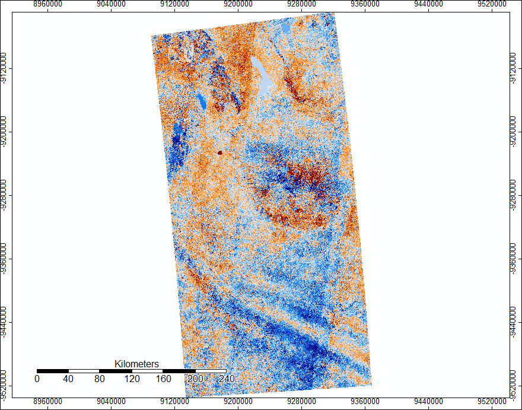
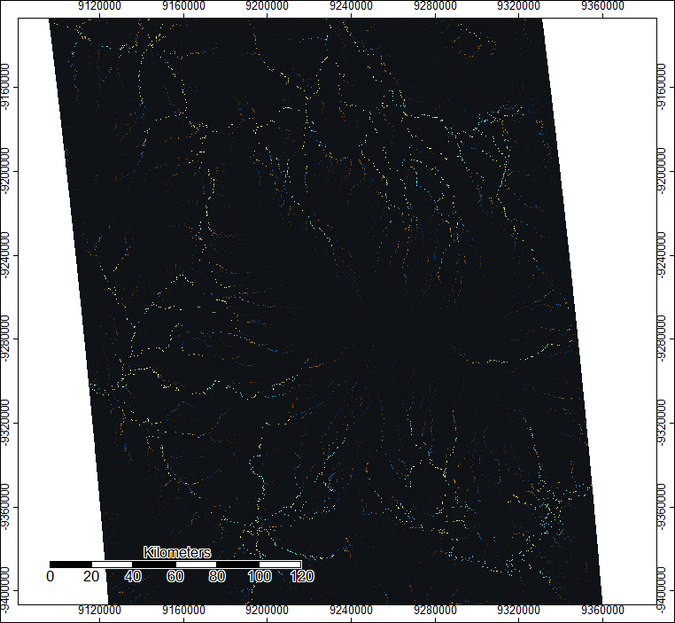

## Lab 4: DEM Analysis using Batch Script Processing 

In our next lab, we focused on completing the same set of tools and analyses (Mosaic, Sink Detection, sink fill, flow accumulation, channel network), only this time we wrote a batch script in order to run the tool. You can access the script [here](batch_asterelevation_analysis.bat). 

As a note, this tool took quite a long time to run, as creating a channel network of the flow accumulation takes a great deal of computing. In the future, I would only use this tool on a smaller, more specified area, and would consider increasing the threshold for which streams to classify. 

One additional resource we used were the .num files for both ASTER and SRTM data. These .num files show error, which is important to consider when running analysis. 

This image shows the regions of error or uncertainty within the SRTM's data of Mt. Kilimanjaro. Everything in beige represents SRTM data, while other colored areas represent uncertainty; the legend shows which data sorce was used to pull in data to account for that. Of most importance are the areas in red, where this SRTM file used ASTER data to account for error. 
 

This next image is the .num file for ASTER data of Mt. Kili. There was quite a bit of error in the south, and SRTM data was pulled in for that area. However, this file seems to show less error overall. 
 

Next, we used SAGA's Grid Difference tool to show regions of diversion within the ASTER and SRTM outputs. This next image shows the difference of starting elevation models. Here we can see that northern region that could be causing some troubles in terms of error: 

The darker red sections to the north and then right on the mountain itself align with higher levels of uncertainty, which is unsurprising and is also shown in the .num files. Additionally, here is the difference between resulting Flow Accumulation output:

 

Data sources: 
www.earthdata.nasa.gov
SAGA 6.2
QGIS 3.8.1
