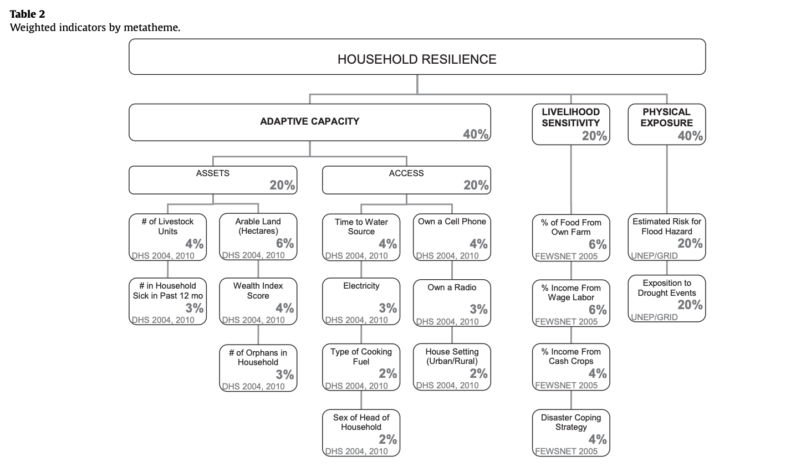
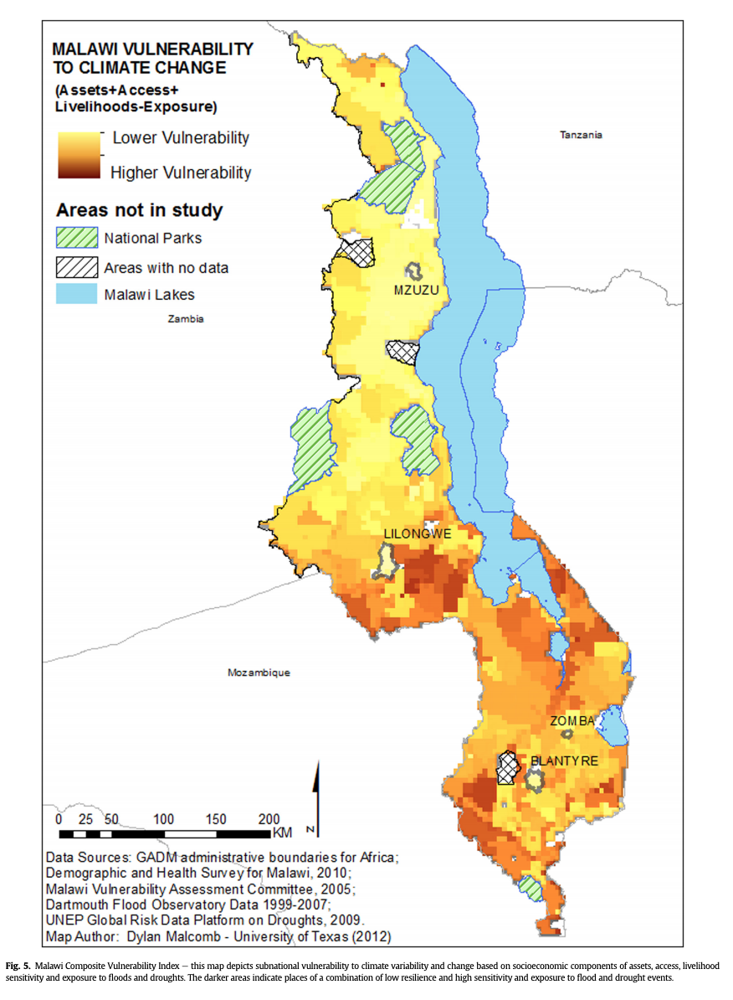
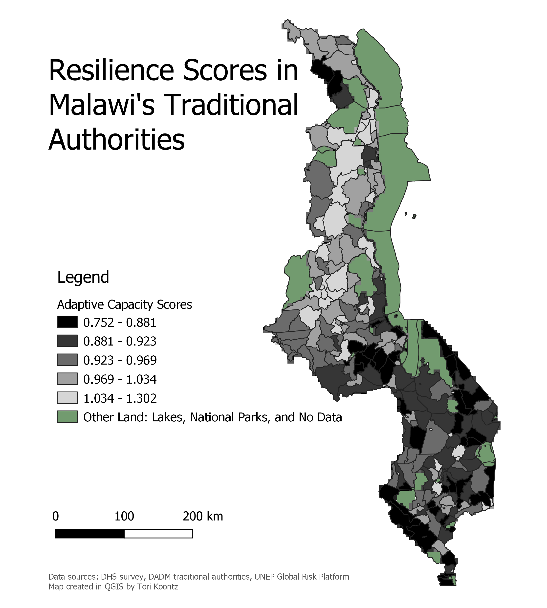
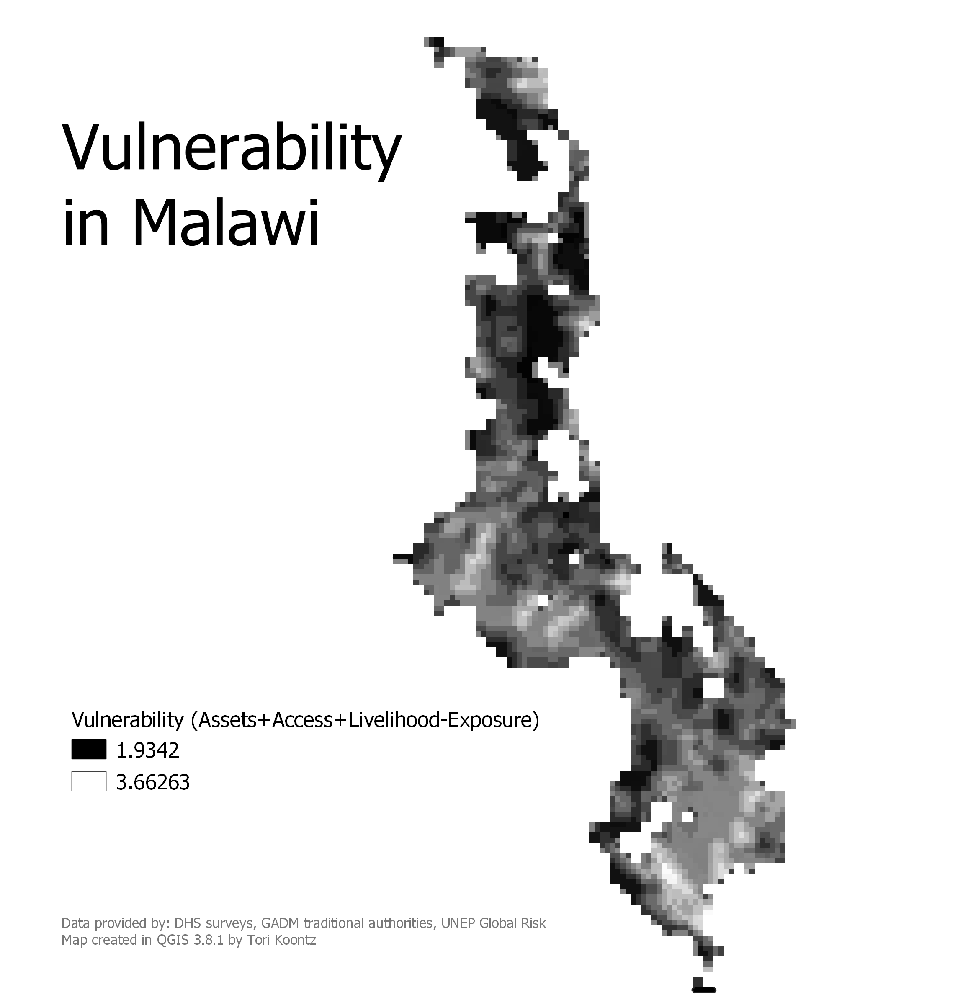

## Resilience and Reproducibility: Malawi as a case study 

Over the course of two weeks, our class discussed critical ideas of reproducibility and replicability in GIS/data science work. In order to contribute to a fully open source data science world, new published work should strive to accomplish these two goals, so that their research may be redone or reanalyzed by interested parties. We tested this idea of reproducibility through Malcomb et. al'w work, ["Vulnerability modeling for sub-Saharan Africa: An operationalized approach in Malawi"](https://www.sciencedirect.com/science/article/pii/S0143622814000058?via%3Dihub). Our goal in this lab was to use Malcomb's methodology in order to recreate his map of vulnerability. 

Malcolm's methods for measuring household resilience: 

And his final map:

### Methods 

Data sources: 
1. DHS Survey
2. DHS Cluster points
3. GADM Malawi boundaries/traditional authorities
4. UNEP Global Risk Platform data for flood risk and drought exposure 
5. FEWSnet Livelihood Zones

Before I go into the methods, it is important to note that our methodology is only able to account for 80% of Malcomb's final map, as he uses FEWSnet data that is not open and accessible for public use. This is the most glaring problem with reproducibility, and others will be referenced later. 

The first part of creating the final end result is to calculate the "Adaptive Capacity", which uses DHS Survey data and creates a way to weight each factor according to importance. First, we used DHS metadata to isolate all the variables represented in Malcom's methodology. We found them all, but ran into another problem of reproducibility in the fact that many of the "Access" factors, like owning a radio, were measured with either a 0 or 1, for yes/no. Malcomb was not clear in his work how he tranformed these 0/1 values into a quantile scale to fit in with the rest of the data. 

As a class, we worked to draft an [SQL code](https://github.com/GIS4DEV/GIS4DEV.github.io/tree/master/mwi) for rescaling each variable and ranking it as a quantile. In addition to ranking, the code includes steps for deleting missing data and other joins.

The next part to Malcomb's final calculation is including UNEP Global Risk data on exposure, via flood and drought data. When we downloaded the raster files from UNEP's website, they did not match up and had to be rescaled to fit the 1-5 quantile ranking. I accomplished that by using GDAL's Warp tool, and then by using GRASS functions like r.Quantile and r.Recode. The layers also need to be clipped to include only relevant data, which can be done using the GDAL Clip by Extent.

Next, we needed to convert the layer with adaptive capacity (henceforth called "capacity") to a raster, which can be accomplished using GDAL's Rasterize tool. Once all three layers (capacity, flood, and drought) were in the same format (CRS, cell size, quantile rank), we can run Professor Holler's Vulverability model, which incorporates our SQL code and produces three layers, identical in dimension/classification, for capacity, flood, and drought. 

This is my map which shows the adaptive capacity rank for each Traditional Authority:

Next, we used Raster calculator to combine the three raster layers, according to the weighting done in the Malcomb methodology. He lists his final calculation as Assets + Access + Livelihood - Exposure. However, we needed to remember that the various quantile ranks don't exactly correlate: A high score for Assets/Access means lower vulnerability, whereas a high ranking for the flood and drought layers correlates to higher vulnerability. As such, our calculation for combining the layers was (2-(Capacity * 0.4) + (Drought * 0.2) + (Flood * 0.2)). This output gave me my final map of vulnerability: 

### Discussion

